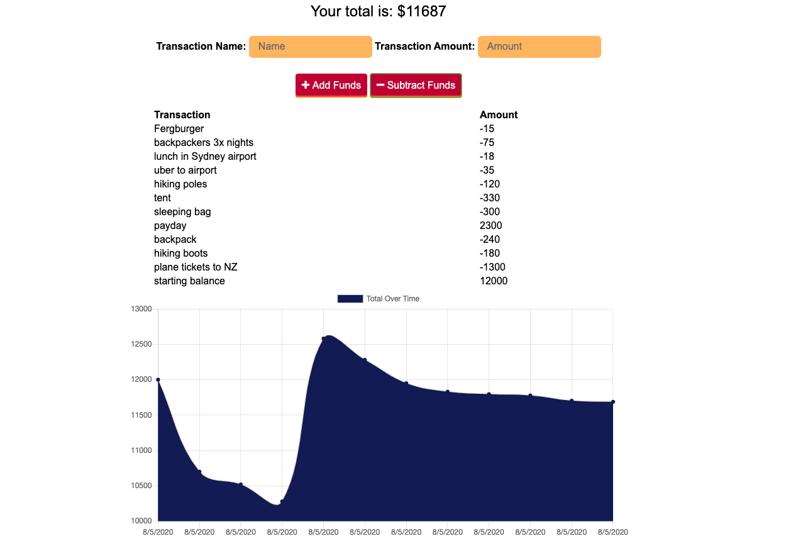

# Track My Budget

## Save Budget Data While Online or Offline  

  

## Table of Contents

* [Description](#description)
* [Installation](#installation)
* [Usage](#usage)
* [License](#license)
* [Contributing](#contribution)
* [Tests](#tests)
* [Questions](#questions)

## Description 

This is a simple application that allows the user to track their spending habits and the amount of money they currently have for whatever they have assigned. It is backed by a Mongo database, but also has offline tracking capability because data is saved to cached storage. The app also has Progressive Web Application capability. I made it to experiment with each of these things mentioned.   

## Installation

To install the application and see it operating from your local computer, clone the repo here in Github, and be sure to have or make an account with MongoDB. From the command line, run 'npm start'. You can also see the deployed application [here]().

## Usage 

Once you've started the application, simply input the name of a transaction, the amount the transaction is for, and click on whether that amount is to be added or subtracted from the current balance.  

## License

This application is covered under a [MIT License](https://opensource.org/licenses/MIT).

## Contributing

To contribute, create a pull request:

* Fork the repo
* Create a feature branch (git checkout -b NAME-HERE)
* Commit new feature (git commit -m "Message about new feature")
* Push your branch (git push)
* Create new pull request

Your code will be reviewed and merged.

## Tests

No tests at this point.

## Questions

Got questions? Feel free to contact me.  
Github username: [domjparker](https://github.com/domjparker)  

---

© 2020, Dominic Parker. All Rights Reserved.

